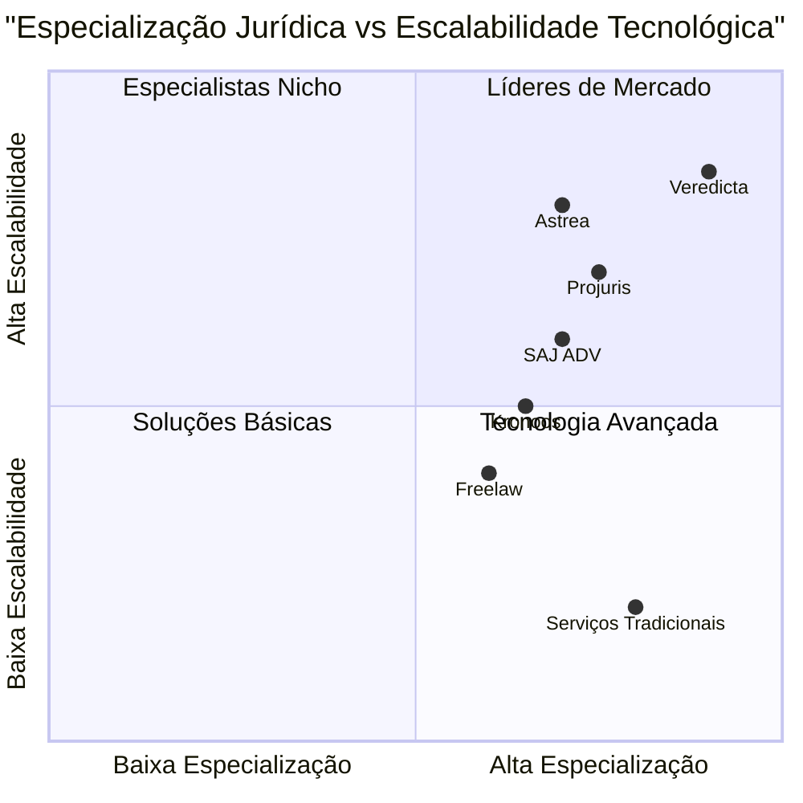

# PRD - Plataforma Veredicta
## Product Requirements Document

**Versão:** 1.0  
**Data:** 17 de Julho de 2025  
**Linguagem:** Português (Brasil)  
**Linguagem de Programação:** TypeScript, Shadcn-ui, Tailwind CSS  
**Nome do Projeto:** veredicta_platform  

---

## 1. Reafirmação dos Requisitos Originais

A plataforma Veredicta é uma solução inovadora para terceirização de petições judiciais sob demanda, direcionada a escritórios de advocacia de médio e grande porte. O sistema oferece agilidade, qualidade e escalabilidade na produção de peças jurídicas através de três áreas principais:

- **Área do Cliente** (escritórios/advogados)
- **Área do Redator** (prestador de serviço jurídico)
- **Área Administrativa** (Backoffice/Admin)

O sistema garante acesso segmentado e seguro, permitindo que cada tipo de usuário acesse apenas as funcionalidades pertinentes ao seu perfil.

---

## 2. Definição do Produto

### 2.1 Objetivos do Produto

1. **Democratizar o acesso a serviços jurídicos especializados:** Conectar escritórios de advocacia com redatores jurídicos qualificados, oferecendo uma plataforma escalável e eficiente para terceirização de petições.

2. **Otimizar a produtividade dos escritórios:** Reduzir o tempo gasto em tarefas operacionais de redação, permitindo que advogados foquem em atividades estratégicas e de maior valor agregado.

3. **Criar um ecossistema jurídico sustentável:** Estabelecer uma rede confiável de profissionais jurídicos freelance, garantindo qualidade, agilidade e transparência nos processos.

### 2.2 Histórias de Usuário

**Como escritório de advocacia de médio porte:**
- Quero solicitar petições jurídicas especializadas de forma rápida e eficiente, para que possa atender mais clientes sem sobrecarregar minha equipe interna.

**Como advogado sênio:**
- Quero ter visibilidade completa do status das petições solicitadas e controle do meu orçamento de créditos, para que possa planejar melhor os custos operacionais.

**Como redator jurídico freelance:**
- Quero acessar uma lista de petições disponíveis na minha área de especialização, para que possa maximizar minha renda com trabalhos compatíveis com minha expertise.

**Como gestor administrativo:**
- Quero ter visão completa de todos os processos da plataforma e controlar a qualidade dos serviços, para que possa garantir a satisfação dos clientes e redatores.

**Como escritório enterprise:**
- Quero ter acesso a um gestor de conta dedicado e SLA personalizado, para que possa integrar a plataforma aos meus processos internos de forma otimizada.

### 2.3 Análise Competitiva

Com base na pesquisa de mercado, identificamos os principais concorrentes e soluções similares:

1. **Freelaw**
   - **Prós:** Preços competitivos (R$ 105 por petição), planos mensais flexíveis
   - **Contras:** Limite de peças simultâneas, foco apenas em petições avulsas

2. **Astrea (Aurum)**
   - **Prós:** Mais de 100.000 usuários, plano gratuito disponível, 25 anos de mercado
   - **Contras:** Foco em software de gestão, não especificamente em terceirização

3. **Projuris ADV**
   - **Prós:** 31.000 advogados ativos, comprovada melhoria de produtividade (+75%)
   - **Contras:** Solução interna, não oferece rede de redatores terceirizados

4. **SAJ ADV**
   - **Prós:** Inteligência artificial integrada, sincronização com calendários
   - **Contras:** Foco em automação interna, não em marketplace de serviços

5. **Kronoos**
   - **Prós:** Crescimento de 45% no faturamento, especializada em terceirização jurídica
   - **Contras:** Foco em processos gerais, não especificamente em petições

6. **Plataformas Tradicionais de Freelance**
   - **Prós:** Base ampla de profissionais
   - **Contras:** Falta de especialização jurídica, ausência de controle de qualidade específico

7. **Serviços de Apoio Jurídico Tradicionais**
   - **Prós:** Relacionamento estabelecido, conhecimento local
   - **Contras:** Baixa escalabilidade, preços menos transparentes (R$ 150-450 por audiência)

### 2.4 Quadrante Competitivo



---

## 3. Especificações Técnicas

### 3.1 Análise de Requisitos

A plataforma Veredicta requer uma arquitetura robusta que suporte:

- **Autenticação e autorização segmentada** por tipo de usuário
- **Sistema de créditos e pagamentos** integrado com gateways brasileiros
- **Gestão de arquivos** com segurança jurídica (criptografia, logs de acesso)
- **Workflow automatizado** para atribuição e acompanhamento de petições
- **Dashboard analítico** com métricas em tempo real
- **Notificações multi-canal** (email, SMS, push)
- **API preparada** para integrações futuras com softwares jurídicos

### 3.2 Pool de Requisitos

#### Prioridade P0 (Críticos - MVP)

**Autenticação e Segurança:**
- DEVE implementar login seguro com email/senha para todos os perfis
- DEVE garantir acesso segmentado por tipo de usuário (cliente/redator/admin)
- DEVE implementar criptografia end-to-end para documentos sensíveis
- DEVE manter logs de auditoria completos (LGPD compliance)

**Core Business - Área do Cliente:**
- DEVE permitir cadastro completo de escritórios com dados corporativos
- DEVE exibir saldo de créditos em tempo real
- DEVE permitir solicitação de petições com formulário estruturado
- DEVE gerar ID único para cada petição solicitada
- DEVE permitir upload de arquivos (Word, PDF, imagens até 10MB)

**Core Business - Área do Redator:**
- DEVE permitir cadastro com especialização jurídica
- DEVE exibir lista de petições disponíveis filtradas por especialização
- DEVE permitir aceitar/recusar petições com justificativa
- DEVE permitir upload de petição finalizada e nota fiscal

**Core Business - Área Administrativa:**
- DEVE fornecer visão completa de todos os usuários e transações
- DEVE permitir atribuição manual de petições a redatores
- DEVE controlar status de petições (pendente/aceita/entregue/aprovada)
- DEVE gerenciar pagamentos de redatores

#### Prioridade P1 (Importantes - V2)

**Sistema de Pagamentos:**
- DEVE integrar com gateways de pagamento brasileiros (Pix, cartão)
- DEVE processar pagamentos de planos mensais automaticamente
- DEVE calcular comissões de redatores automaticamente
- DEVE gerar relatórios financeiros detalhados

**Gestão de Planos:**
- DEVE implementar todos os planos definidos (Start, Profissional, Premium, Enterprise)
- DEVE controlar limites de petições por plano
- DEVE permitir upgrade/downgrade de planos
- DEVE notificar sobre limites próximos do esgotamento

**Notificações e Comunicação:**
- DEVE enviar emails automáticos para cada mudança de status
- DEVE notificar redatores sobre novas petições disponíveis
- DEVE alertar administradores sobre petições atrasadas
- DEVE implementar chat interno básico entre cliente e redator

#### Prioridade P2 (Desejáveis - V3)

**Analytics e Relatórios:**
- PODE implementar dashboard com gráficos avançados
- PODE fornecer métricas de performance por redator
- PODE gerar relatórios personalizados por período
- PODE implementar análise preditiva de demanda

**Integrações Externas:**
- PODE integrar com APIs de softwares jurídicos (CPJ, Astrea, Projuris)
- PODE implementar sincronização com calendários externos
- PODE conectar com sistemas de gestão de escritórios
- PODE implementar webhook para notificações externas

**Features Avançadas:**
- PODE implementar sistema de avaliação de qualidade
- PODE oferecer templates de petições pré-aprovados
- PODE implementar IA para triagem automática de petições
- PODE fornecer estimativas de prazo automatizadas

### 3.3 Esboço de Design da Interface

#### Área do Cliente - Painel Principal
```
┌─────────────────────────────────────────────────┐
│ VEREDICTA - Painel do Cliente                   │
├─────────────────────────────────────────────────┤
│ Bem-vindo, [Nome do Escritório]                 │
│                                                 │
│ ┌─────────────┐ ┌─────────────┐ ┌─────────────┐ │
│ │   Créditos  │ │   Petições  │ │    Plano    │ │
│ │     85      │ │      12     │ │ Profissional│ │
│ │ Disponíveis │ │ Ativas      │ │ R$ 5.000/mês│ │
│ └─────────────┘ └─────────────┘ └─────────────┘ │
│                                                 │
│ [+ Nova Petição]           [Histórico Completo] │
│                                                 │
│ Petições Recentes:                              │
│ ┌─────────────────────────────────────────────┐ │
│ │ #VER001 - Contestação - Em Produção        │ │
│ │ #VER002 - Recurso - Finalizada            │ │
│ │ #VER003 - Inicial - Aguardando Redator    │ │
│ └─────────────────────────────────────────────┘ │
└─────────────────────────────────────────────────┘
```

#### Área do Redator - Lista de Petições
```
┌─────────────────────────────────────────────────┐
│ VEREDICTA - Área do Redator                     │
├─────────────────────────────────────────────────┤
│ Filtros: [Direito Civil] [Todas] [Disponíveis]  │
│                                                 │
│ Petições Disponíveis (5):                      │
│ ┌─────────────────────────────────────────────┐ │
│ │ #VER001 - Contestação - Direito Civil      │ │
│ │ Prazo: 3 dias | Valor: R$ 250             │ │
│ │ [Ver Detalhes] [Aceitar Petição]          │ │
│ └─────────────────────────────────────────────┘ │
│                                                 │
│ Minhas Petições Aceitas (2):                   │
│ ┌─────────────────────────────────────────────┐ │
│ │ #VER045 - Recurso - Em Andamento           │ │
│ │ Prazo: 1 dia | [Upload Petição]           │ │
│ └─────────────────────────────────────────────┘ │
└─────────────────────────────────────────────────┘
```

#### Área Administrativa - Dashboard
```
┌─────────────────────────────────────────────────┐
│ VEREDICTA - Painel Administrativo               │
├─────────────────────────────────────────────────┤
│ ┌──────────┐┌──────────┐┌──────────┐┌──────────┐│
│ │Clientes  ││Redatores ││Petições  ││Receita   ││
│ │   124    ││   87     ││   456    ││ R$ 89k   ││
│ │  ativos  ││  ativos  ││  ativas  ││   mês    ││
│ └──────────┘└──────────┘└──────────┘└──────────┘│
│                                                 │
│ Petições Pendentes de Atribuição:              │
│ ┌─────────────────────────────────────────────┐ │
│ │ #VER123 - Inicial - Dir. Trabalhista       │ │
│ │ Cliente: Escritório ABC | Urgente          │ │
│ │ [Atribuir Manualmente] [Auto-Atribuir]    │ │
│ └─────────────────────────────────────────────┘ │
└─────────────────────────────────────────────────┘
```

### 3.4 Questões em Aberto

1. **Integração com e-CAC/PJE:** Como será implementada a integração futura com os sistemas dos tribunais para protocolo automático?

2. **Critérios de Qualidade:** Quais serão os parâmetros específicos para avaliação da qualidade das petições entregues?

3. **SLA por Tipo de Petição:** Diferentes tipos de petição terão prazos de entrega distintos? Como será feita essa diferenciação?

4. **Política de Reembolso:** Em que situações o cliente terá direito a reembolso de créditos ou reelaboração de petições?

5. **Certificação de Redatores:** Haverá processo de certificação ou teste para redatores se cadastrarem na plataforma?

6. **Backup e Disaster Recovery:** Qual será a política de backup dos documentos jurídicos e plano de continuidade de negócios?

7. **Compliance LGPD:** Quais medidas específicas serão implementadas para garantir conformidade total com a Lei Geral de Proteção de Dados?

8. **Escalabilidade de Infraestrutura:** Como a plataforma será dimensionada para suportar crescimento exponencial (baseado no crescimento de 300% do setor)?

---

## Conclusão

A plataforma Veredicta está posicionada para capitalizar o crescimento explosivo do mercado de legaltech brasileiro, oferecendo uma solução especializada que conecta escritórios de advocacia com redatores qualificados. Com foco na qualidade, escalabilidade e user experience, a plataforma tem potencial para se tornar referência no segmento de terceirização jurídica no Brasil.

O roadmap de desenvolvimento prioriza a entrega de um MVP robusto que atenda às necessidades essenciais do mercado, seguido de iterações que adicionarão funcionalidades avançadas baseadas no feedback dos usuários e evolução do mercado.