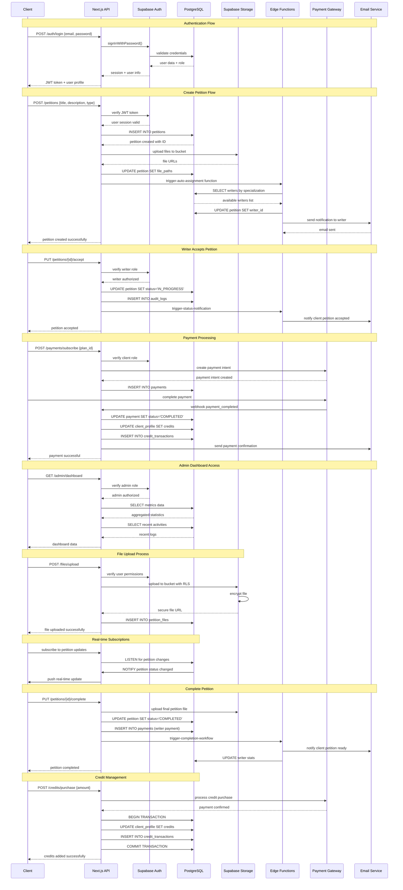

# Sistema Veredicta - Arquitetura Completa

## Implementation approach

A plataforma Veredicta será desenvolvida como uma aplicação web moderna utilizando arquitetura baseada em microsserviços com Supabase como backend-as-a-service. O sistema implementará:

- **Frontend**: Next.js 14 com TypeScript, Shadcn-ui e Tailwind CSS para interface responsiva
- **Backend**: Supabase com PostgreSQL, Auth, Storage e Edge Functions
- **Autenticação**: Row Level Security (RLS) nativo do Supabase para controle granular de acesso
- **Pagamentos**: Integração com Stripe para cartão e Pix via providers brasileiros
- **Notificações**: Sistema de email transacional com Resend
- **Storage**: Supabase Storage para arquivos jurídicos com criptografia
- **Real-time**: Subscriptions do Supabase para atualizações em tempo real

**Pontos críticos identificados:**
1. Segurança jurídica dos documentos (criptografia end-to-end)
2. Controle de acesso granular por perfil de usuário
3. Sistema de créditos com transações ACID
4. Workflow de petições com estados bem definidos
5. Compliance LGPD para dados sensíveis

## Data structures and interfaces

```mermaid
classDiagram
    class User {
        +id: UUID
        +email: string
        +password_hash: string
        +role: UserRole
        +created_at: timestamp
        +updated_at: timestamp
        +is_active: boolean
        +last_login: timestamp
        +__init__(email: string, password: string, role: UserRole)
        +authenticate(password: string) boolean
        +update_profile(data: dict) void
        +deactivate() void
    }

    class ClientProfile {
        +id: UUID
        +user_id: UUID
        +company_name: string
        +cnpj: string
        +plan_id: UUID
        +credits_balance: integer
        +contact_person: string
        +phone: string
        +address: string
        +created_at: timestamp
        +__init__(user_id: UUID, company_data: dict)
        +get_active_plan() Plan
        +update_credits(amount: integer) void
        +get_credit_history() list[CreditTransaction]
    }

    class WriterProfile {
        +id: UUID
        +user_id: UUID
        +full_name: string
        +cpf: string
        +cnpj: string
        +oab_number: string
        +specializations: string[]
        +hourly_rate: decimal
        +rating: decimal
        +completed_petitions: integer
        +pending_payment: decimal
        +created_at: timestamp
        +__init__(user_id: UUID, professional_data: dict)
        +add_specialization(area: string) void
        +update_rating(new_rating: decimal) void
        +calculate_earnings() decimal
    }

    class AdminProfile {
        +id: UUID
        +user_id: UUID
        +full_name: string
        +permissions: string[]
        +department: string
        +created_at: timestamp
        +__init__(user_id: UUID, admin_data: dict)
        +has_permission(permission: string) boolean
        +get_system_metrics() dict
    }

    class Plan {
        +id: UUID
        +name: string
        +price: decimal
        +monthly_petitions: integer
        +features: string[]
        +is_active: boolean
        +created_at: timestamp
        +__init__(name: string, price: decimal, petitions: integer)
        +calculate_overage_cost(extra_petitions: integer) decimal
        +get_feature_list() string[]
    }

    class Subscription {
        +id: UUID
        +client_id: UUID
        +plan_id: UUID
        +status: SubscriptionStatus
        +current_period_start: timestamp
        +current_period_end: timestamp
        +petitions_used: integer
        +created_at: timestamp
        +__init__(client_id: UUID, plan_id: UUID)
        +is_active() boolean
        +renew_subscription() void
        +upgrade_plan(new_plan_id: UUID) void
    }

    class Petition {
        +id: UUID
        +client_id: UUID
        +writer_id: UUID
        +petition_type: string
        +title: string
        +description: text
        +status: PetitionStatus
        +priority: PetitionPriority
        +deadline: timestamp
        +estimated_hours: integer
        +actual_hours: integer
        +value: decimal
        +created_at: timestamp
        +accepted_at: timestamp
        +completed_at: timestamp
        +__init__(client_id: UUID, petition_data: dict)
        +assign_writer(writer_id: UUID) void
        +update_status(status: PetitionStatus) void
        +calculate_payment() decimal
        +get_time_remaining() integer
    }

    class PetitionFile {
        +id: UUID
        +petition_id: UUID
        +file_name: string
        +file_path: string
        +file_type: string
        +file_size: integer
        +uploaded_by: UUID
        +is_final: boolean
        +created_at: timestamp
        +__init__(petition_id: UUID, file_data: dict)
        +encrypt_file() void
        +generate_download_url() string
        +validate_file_type() boolean
    }

    class Payment {
        +id: UUID
        +client_id: UUID
        +writer_id: UUID
        +petition_id: UUID
        +amount: decimal
        +payment_type: PaymentType
        +status: PaymentStatus
        +gateway_transaction_id: string
        +created_at: timestamp
        +processed_at: timestamp
        +__init__(payer_id: UUID, amount: decimal, type: PaymentType)
        +process_payment() boolean
        +refund_payment() boolean
        +generate_invoice() string
    }

    class CreditTransaction {
        +id: UUID
        +client_id: UUID
        +amount: integer
        +transaction_type: CreditTransactionType
        +reference_id: UUID
        +description: string
        +created_at: timestamp
        +__init__(client_id: UUID, amount: integer, type: CreditTransactionType)
        +validate_transaction() boolean
        +apply_transaction() void
    }

    class Notification {
        +id: UUID
        +user_id: UUID
        +title: string
        +message: text
        +notification_type: NotificationType
        +is_read: boolean
        +sent_at: timestamp
        +read_at: timestamp
        +__init__(user_id: UUID, notification_data: dict)
        +mark_as_read() void
        +send_email() void
        +send_push() void
    }

    class AuditLog {
        +id: UUID
        +user_id: UUID
        +action: string
        +resource_type: string
        +resource_id: UUID
        +old_values: json
        +new_values: json
        +ip_address: string
        +user_agent: string
        +created_at: timestamp
        +__init__(user_id: UUID, action: string, resource: dict)
        +log_action() void
        +get_user_history(user_id: UUID) list[AuditLog]
    }

    %% Enums
    class UserRole {
        <<enumeration>>
        CLIENT
        WRITER
        ADMIN
        SUPER_ADMIN
    }

    class PetitionStatus {
        <<enumeration>>
        PENDING
        ASSIGNED
        IN_PROGRESS
        COMPLETED
        APPROVED
        REJECTED
        CANCELLED
    }

    class PaymentStatus {
        <<enumeration>>
        PENDING
        PROCESSING
        COMPLETED
        FAILED
        REFUNDED
    }

    %% Relationships
    User ||--|| ClientProfile : "has"
    User ||--|| WriterProfile : "has"
    User ||--|| AdminProfile : "has"
    User ||--o{ Notification : "receives"
    User ||--o{ AuditLog : "performs"

    ClientProfile ||--|| Subscription : "has"
    ClientProfile ||--o{ Petition : "creates"
    ClientProfile ||--o{ Payment : "makes"
    ClientProfile ||--o{ CreditTransaction : "has"

    WriterProfile ||--o{ Petition : "accepts"
    WriterProfile ||--o{ Payment : "receives"

    Plan ||--o{ Subscription : "includes"
    
    Petition ||--o{ PetitionFile : "contains"
    Petition ||--|| Payment : "generates"
    
    Subscription }|--|| Plan : "follows"
```

## Program call flow



## Anything UNCLEAR

As seguintes questões precisam de esclarecimento para completar a implementação:

1. **Integração PIX**: Qual provider será utilizado (Mercado Pago, PagSeguro, Stripe Brasil) para processamento de pagamentos PIX?

2. **Criptografia de Arquivos**: Será implementada criptografia client-side antes do upload ou server-side no Supabase Storage?

3. **SLA por Tipo de Petição**: Quais são os prazos específicos para cada tipo de petição (inicial, recurso, contestação, etc.)?

4. **Auto-atribuição de Petições**: Quais critérios serão usados (especialização, carga de trabalho, rating, disponibilidade)?

5. **Compliance LGPD**: Período de retenção de dados e processo de anonização/exclusão de dados pessoais?

6. **Backup e Disaster Recovery**: Frequência de backups e RTO/RPO requirements para continuidade do negócio?

7. **Rate Limiting**: Limites de API calls por usuário e por endpoint para evitar abuso?

8. **Ambiente de Homologação**: Será necessário ambiente staging separado com dados de teste?

9. **Monitoramento**: Quais métricas de performance e alertas serão implementados (latência, uptime, erros)?

10. **Certificação de Redatores**: Processo de verificação de OAB e validação de especialização será manual ou automatizado?